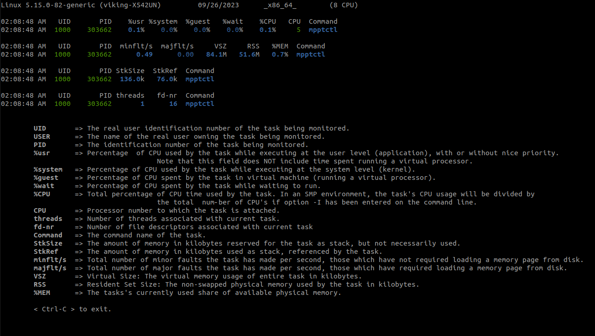

## Monitoring on a process
This is an interactive tool for monitoring on a process of `linux` system. I hope it will be useful for debugging. 

### Requirements:
- bash <default: linux>
- pidstat
- tput <default: linux>

### Install dependencies:

```
$ sudo apt update && sudo apt install sysstat
```

### Help
```
ubuntu@ubuntu:~ $ ./pid_monitor
Usage: ./pid_monitor <pid>
```

### Console Output


